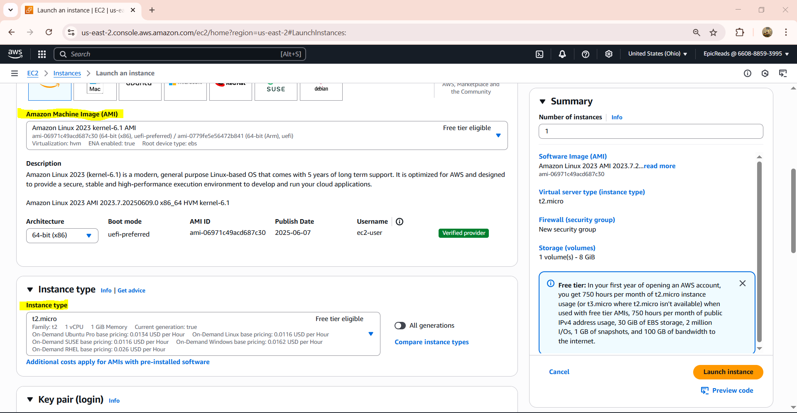
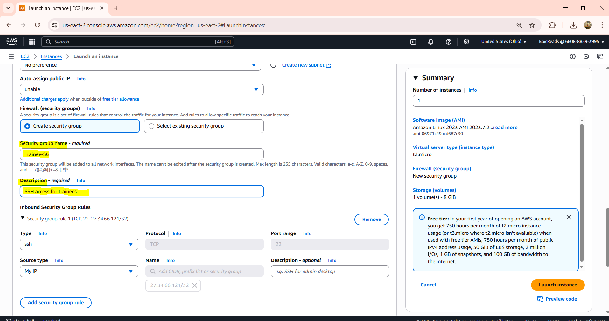
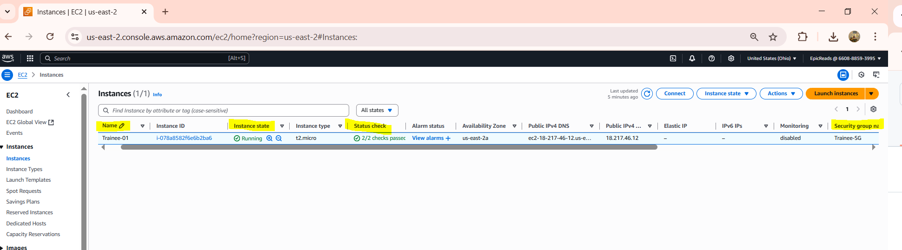

# AWS Bulk User Management

## Project Overview
This project demonstrates the implementation of secure AWS environments with a focus on bulk user management for trainees. It involves provisioning EC2 instances and creating IAM users in bulk using AWS CLI and scripts.

### Use Case:
- 🖥️ **Trainees**: Provisioning isolated EC2 instances for hands-on training and bulk IAM user creation.

## Task 1: EC2 Setup for Trainees

### Objective:
Provision isolated EC2 instances for training purposes, ensuring that each trainee has a secure environment.

### Steps:
1. **Launch Amazon Linux EC2 Instance**
   - **AMI**: Amazon Linux 2023  
   - **Instance Type**: t2.micro  
   - **Key Pair**: `trainee-key.pem`  
   - **Security Group**: Restrict SSH access to the trainer's IP address.

2. **Configure Security Group**
   - Create a custom security group `Trainee-SG` with an inbound rule to allow SSH only from the trainer's IP.

3. **Verification**
   - After launching the EC2 instance, verify its status and ensure the instance is running.
   - Instance ID: `i-123abc`  
   - Status: `2/2 checks passed`

**Screenshots:**
- 
- 
- 
- 
- 
- 

## Task 2: IAM User Management

### User Generation for Trainees:
A bulk IAM user creation process was developed using a Python script to generate a `.csv` file, which was then used with AWS CLI for creating IAM users.

### Steps:
1. **Generate the CSV File**  
   A Python script located in the `utilities/` folder generates a CSV file with 100 test users. This file contains the user names, randomized passwords, and placeholders for AWS Access Keys and Secret Keys. The Python script is located at `utilities/generate_users.py`.

2. **Use PowerShell to Create IAM Users from CSV**  
   After generating the `.csv` file, the AWS CLI was used to bulk create users. The script used the following PowerShell commands to read the CSV file and create IAM users, assign them to groups, and create login profiles for each user.

   **PowerShell Command to Import Users:**
   ```powershell
   # PowerShell script for bulk user creation
   $csv = Import-Csv .\trainee-users.csv
   foreach ($user in $csv) {
       aws iam create-user --user-name $user.'User Name'
       aws iam add-user-to-group --group-name TraineeGroup --user-name $user.'User Name'
       aws iam create-login-profile --user-name $user.'User Name' --password $user.Password --password-reset-required
   }
3. Verification
After running the PowerShell script, the AWS Management Console was used to verify the creation of 100 IAM users and confirm that they were assigned to the correct IAM group (TraineeGroup).

4. IAM Group and Policy for Sales Team (Example)
Although the focus of this project is on Trainees, the SalesTeam group is referenced for understanding IAM policies. The SalesTeam group was assigned the AmazonS3ReadOnlyAccess policy, granting users read-only access to S3 buckets.

SalesTeam Group: The group contains 100 users.

Policy Attached: AmazonS3ReadOnlyAccess, which allows users to list and read objects in S3, but not modify them.

**Screenshots:**
This screenshot shows the SalesTeam group in IAM, with the AmazonS3ReadOnlyAccess policy attached. While this example is for SalesTeam, similar steps were followed for the Trainee users.
- 

## Project Structure 
pgsql
Copy
Edit
aws-bulk-user-management/
├── utilities/
│   └── generate_users.py       # Python script to generate the CSV file for user creation
├── scripts/
│   └── .gitignore              # Ignores trainee-users.csv for security
└── screenshots/
    ├── task1-3c-ssh-rule.PNG
    ├── task1-2-ec2-dashboard.PNG
    ├── task1-2-ami-selection.PNG
    ├── task1-3-keypair-download.PNG
    ├── task1-3a-security-groups-list.PNG
    ├── task1-3b-sg-basic-config.PNG
    ├── task1-4-launch-success.PNG
    ├── task2-1-group-creation.PNG
    ├── task2-2-IAM-bulkuserupload-CLI-progress-creation.PNG
    ├── task2-3-IAM-console-verify.PNG
    └── task2-4-iam-sales-team-policy.PNG
Security Considerations
Passwords are automatically generated based on AWS complexity requirements and are securely handled.

The CSV file containing user credentials is excluded from the repository via .gitignore to prevent exposure of sensitive data.

Future Improvements
Implementing MFA (Multi-Factor Authentication) for added security.

Expanding the user generation script for additional use cases, such as different access policies.

Automating user lifecycle management (e.g., deactivation upon role changes).